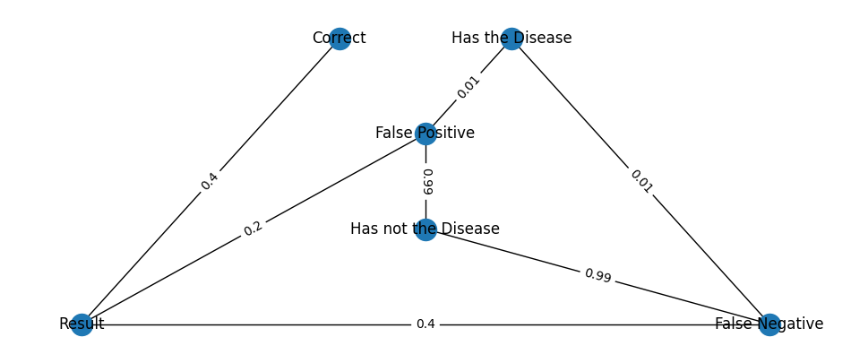
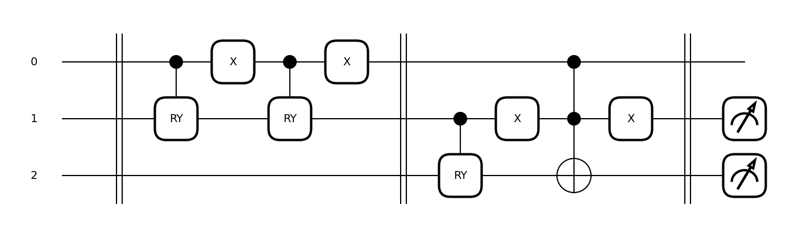
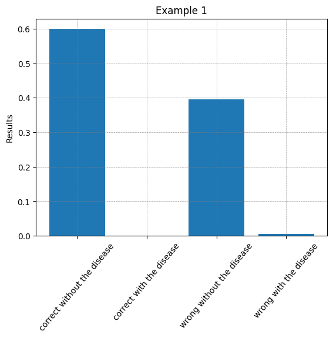
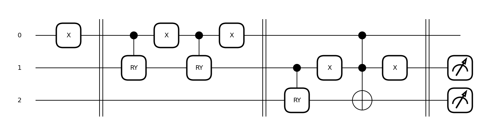
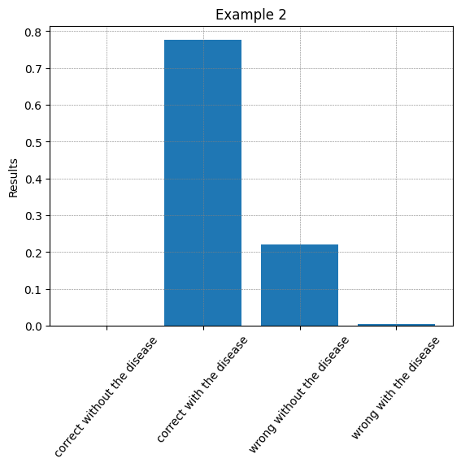

# Bayesian Networks

This project was meant to be an example to be given during my quantum machine learning [mini-course](https://github.com/Dpbm/qml-course).
However, due to the amount of time I was given, I decided to remove these example about Bayesian Networks and focus specially on Quantum Convolutional Neural Networks.

Although it was a small snippet of code, I think that it deserved some attention. So, here I am, check out what I did.

## How to Run

All this code was done using Python and PennyLane, so you may need to have [Python3.10](https://www.python.org/) installed as well as all the dependencies required for this project. I recommend you to use `mamba/conda-lock`, but feel free to use whatever you want.

```bash
#mamba setup
mamba env create -f environment.yml

#conda-lock setup
conda-lock install -n bays conda-lock.yml

#pip setup
pip install -r requirements.txt
```

With all configured, you can run:

```bash
jupyter lab bayesian-network.ipynb
```

## Explanation

Is pretty common to see out there, some explanations about Bayesian Theorem using a disease and a test that can give either the correct or the wrong answer (like false positives and negatives). For this case, it won't be different.

A similar probability case was mapped into a quantum circuit with all probabilities embedded as rotations. This way, each qubit has some probability to be in a certain classical state based on the odds pre-modeled.

This kind of network can be seen as a graph, where node is a state and every weight on the edges represents the probability to go to a certain state (much like a automaton).

| qubit | Meaning                      |
|-------|----------------------------------|
|   0   | positive(1) negative(0) |
|   1   | false psotive/negative |
|   2   | chance of having the disease |


| odds | to |
|---------------|-------|
|  0.2          | false positive |
|  0.4         | false negative |
|  0.01         | have the disease given a false positive/negative |



Following this structure, it's very straightforward to create the circuit.



In this case, the first qubit will act as an input, telling what was the test result (positive/negative), then the probability chain will be in charge to compute the probabilities based on the previous state.

After measuring the last two qubits, we have the following distribution:



The same can be experienced when the result value is `1`.




